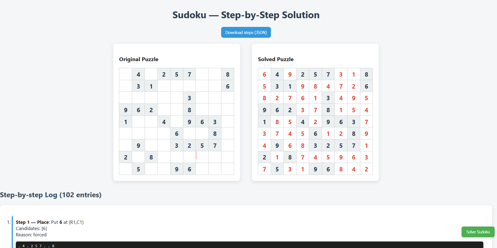

# 🧩 Sudoku Solver – Tampermonkey Script  

A Tampermonkey userscript that automatically extracts Sudoku puzzles from [sudoku.com](https://sudoku.com), solves them using backtracking with detailed step-by-step reasoning, and displays both the solution and the solving process in a clean, styled report.  

---

## ✨ Features  

- ✅ Automatically detects and extracts Sudoku puzzles from the page.  
- ✅ Solves puzzles using a **backtracking algorithm** with candidate elimination and dead-end detection.  
- ✅ Opens the solution in a **new tab** with side-by-side grids (original + solved).  
- ✅ Provides a **step-by-step solving log** with explanations for each move.  
- ✅ Clean **UI styling** for Sudoku grids and explanations.  
- ✅ Optionally integrates with Sudoku.com’s API/session data.  

---

## 📦 Installation  

1. Install the [Tampermonkey](https://www.tampermonkey.net/) browser extension.  
2. Create a new userscript in Tampermonkey.  
3. Copy-paste the contents of `sudoku-solver.user.js` into the script editor.  
4. Save and enable the script.  

---

## 🚀 Usage  

1. Open [sudoku.com](https://sudoku.com).  
2. Choose a difficulty and start a new puzzle.  
3. A **Solve Sudoku** button will appear on the page.  
4. Click it — the solver will analyze the puzzle and open a new tab with:  
   - 📋 **Original puzzle grid**  
   - 🧮 **Solved grid**  
   - 📝 **Step-by-step solving explanation**  

---

## 🎨 Output Preview  

### 🔹 Original Puzzle vs. Solved Puzzle  
  

### 🔹 Step-by-Step Solving Log  
  

---

## 🛠️ Tech Stack  

- **JavaScript** – Core logic and DOM interaction.  
- **Tampermonkey API** – To inject the solver into Sudoku.com.  
- **Backtracking Algorithm** – Recursive solver with logging.  
- **Custom CSS** – Styled grids and explanation panel.  

---

## 📂 Project Structure  

